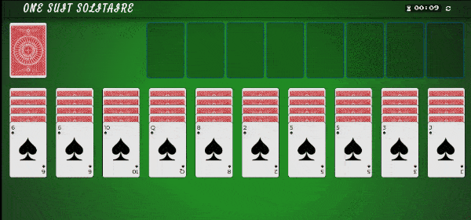
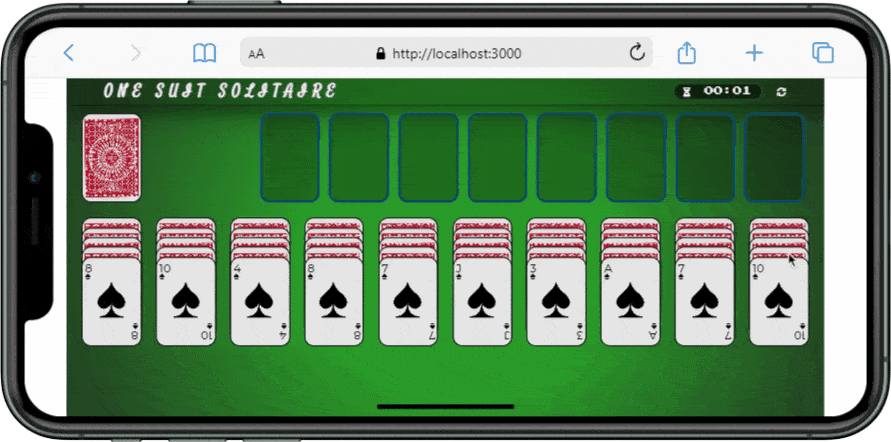
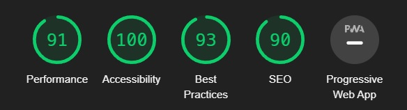

# :spades: One Suit Solitaire

**Live demo avaliable [here.](https://solitaire-one-suit-react.vercel.app/)**

## Project Details:

- Created with ReactJS & styled using with Sass.
- Responsive UI added. App can detech portrait mode and warn you to switch landscape mode.
- Playing with click. (Drag and drop will added soon).
- Lodash,react-timer-hook,react-responsive and node-sass are used libraries for the project.
- Auto deployment on Vercel.

## Lighthouse Performance Result:

## Soon:

- Klondike and Two Suit game modes
- Playing with drag and drop
- Unit tests will be added asap.
